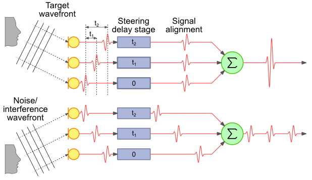
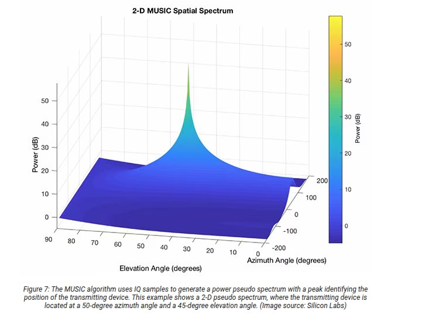
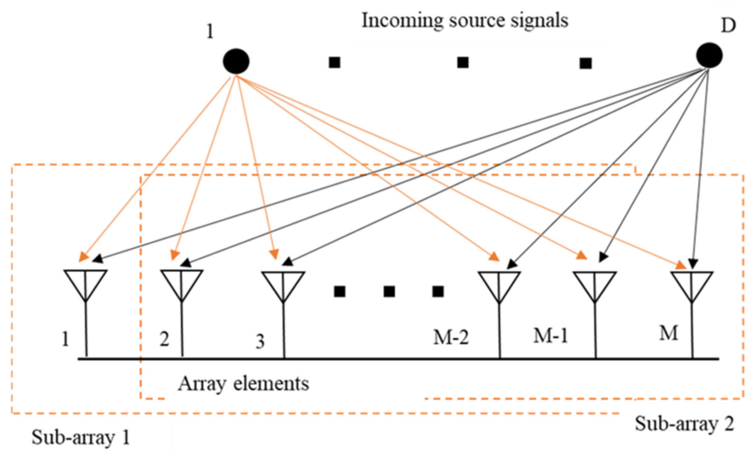
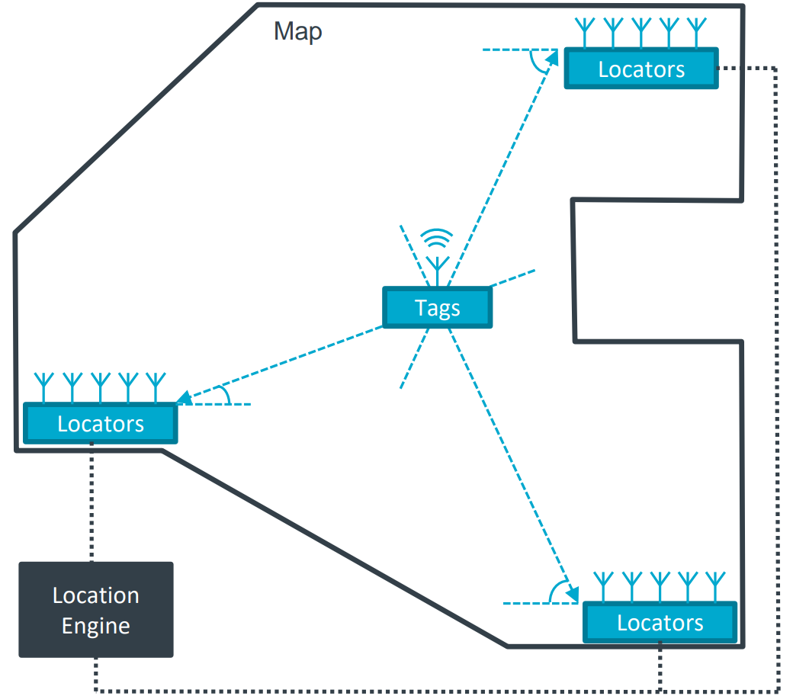

//:imagesdir: ../images

= Angle Estimation Algorithm in the Locator

This document describes the https://arxiv.org/html/2508.11675v2#S3[angle estimation algorithm] used in the system's Locator component. It also explains the different types of algorithms applied for angle estimation, highlighting their benefits and limitations.

Angle of Arrival (AoA) and Direction of Arrival (DoA) are the https://taylorandfrancis.com/knowledge/Engineering_and_technology/Electrical_%26_electronic_engineering/Direction_of_arrival[same concept].

== Classical Beamforming Techniques

Classical beamforming methods use groups of antennas to focus signals in particular directions.

=== Delay-and-Sum Beamforming

DAS works by adjusting the phase of signals coming from different directions and it calculates the output power to create a spatial spectrum, where the peaks show the directions from which the signals arrive.

*Advantages:*

* Easy to implement and requires low computational resources.
* Performs reliably even when there are errors in the assumed signal directions or inaccuracies in calibration.
* Maintains consistent performance across different conditions.

*Limitations:*

* Has limited ability when signals coming from similar directions.
* Performs poorly when strong interfering signals are present.
* Has difficulty separating sources that are very close to each other in angle.

=== Capon Beamforming (MVDR)

The Capon beamforming method reduces the output power while keeping a constant (unity) gain in the desired signal direction. It automatically adjusts to suppress interference by canceling signals from unwanted sources.

**Advantages:**

* Provides higher angular resolution, it can distinguish signals arriving from directions that are very close to each other.
* Effectively minimizes signal variance for improved accuracy.

**Limitations:**

* Involves complex matrix inversion calculations.
* Requires significant computational resources.
* Sensitive to inaccuracies in the assumed system.

=== Linear Prediction (LP) Method

The Linear Prediction (LP) method estimates angles using an **autoregressive (AR) model**, where each signal sample is expressed as a **linear combination of previous samples plus a small prediction error**. 

**Advantages:**

* Performs well even when signals are correlated.
* Uses polynomial rooting, which removes the need for a full spectral search.
* Remains robust against noise in many conditions.
* Computationally efficient and relatively fast to execute.

**Limitations:**

* Requires careful selection of the prediction order.
* Performance is sensitive to incorrect choice of model order.
* Works only with certain array geometries (Uniform Linear array), limiting its general applicability.

== Subspace-Based Methods

Subspace-based methods greatly improve AOA estimation by using the eigenstructure of the array's covariance matrix. They divide the observation space into signal and noise subspaces and estimate the angles of arrival (AOAs) based on the fact that these two subspaces are orthogonal.

=== MUSIC (Multiple Signal Classification) Algorithm

The **MUSIC algorithm** estimates the **directions of arrival (DOAs)** by using the **orthogonality** between the **source steering vectors** and the **noise subspace**.
It produces a **spatial spectrum**, where **peaks indicate the true directions of incoming signals**.

**Eigendecomposition Principle:**

The MUSIC algorithm starts by forming a **covariance matrix** from the signals received at all antennas.
This matrix shows how signals received at different antennas are related.

Then, the **eigendecomposition** process is used to break this matrix into two parts — the **signal subspace** and the **noise subspace** — based on their **eigenvalues** and **eigenvectors**:

* **Eigenvalues** tell how strong each signal is.

  * Large eigenvalues → represent **signal components**.
  * Small eigenvalues → represent **noise**.
* **Eigenvectors** show the direction or structure of these components.

**Advantages:**

* Provides https://www.silabs.com/whitepapers/bluetooth-angle-estimation-for-real-time-locationing#:~:text=In%20an%20ideal%20case,%20MUSIC[**very high resolution**], even when signals are close together.
* Works well with **uncorrelated sources**.

**Limitations:**

* **Sensitive** to inaccurate data.
* Needs a **computationally expensive search** across all possible angles.

=== ESPRIT (Estimation of Signal Parameters via Rotational Invariance Techniques)

ESPRIT utilizes the rotational invariance property of subarrays to estimate the angles of arrival without the need for spectral searching. This “shift-invariance” means the signals arriving at one subarray are a rotated (phase-shifted) version of the signals at the other.

ESPRIT extracts the eigenvalues → converts them into phase shifts → then into angles. No need to scan across all possible values.

*Advantages:*

- No need for spectral search, making it computationally more efficient.
- Performs well with closely spaced sources.
- Less affected by noise than classical methods.

*Limitations:*

- Sensitive to array calibration errors.
- Requires accurate estimation of the number of signals for optimal performance.
- Performance degrades near endfire angles (0° or 180°).

= Positioning Algorithm

== Triangulation (Angle of Arrival-Based Positioning) 

Triangulation determines position using angles from multiple anchors rather than just distances. By deploying several such anchors, the system can triangulate the tag's position at the intersection of the directional lines (or bearing rays) from each anchor. In essence, if two or more locators know “the tag is at X degrees relative to me,” the tag can be found where those angle lines cross on the floor plan. The https://www.bluetooth.com/wp-content/uploads/2019/05/BTAsia/1145-NORDIC-Bluetooth-Asia-2019Bluetooth-5.1-Direction-Finding-Theory-and-Practice-v0.pdf#page=13[Bluetooth SIG highlights] that using multiple AoA-enabled anchors (a “constellation” of them) allows precise triangulation of a device's location.

Commercial solutions like Quuppa and others use AoA triangulation - anchors compute the angle of the tag and a central engine fuses this multi-anchor angle data to output sub-meter position accuracy.

Anchors measure the angle of the tag whereas the location engine computes the intersection of these angles to determine the tag's position.

== Algorithms in the Market

* *MUSIC (Multiple Signal Classification)* is widely recognized as a benchmark algorithm for achieving high-resolution performance. However, it performs poorly with correlated signals and is both costly and computationally demanding due to its exhaustive spectral search process.

* *ESPRIT (Estimation of Signal Parameters via Rotational Invariance)* is another leading subspace-based method often compared with MUSIC. Like MUSIC, it delivers high-resolution results but is more cost-effective and computationally efficient since it eliminates the need for exhaustive spectral searching.

=== Best Choice

* *ESPRIT* is the preferred choice for our system, offering an optimal balance between high resolution, computational efficiency, and cost-effectiveness. By avoiding the exhaustive spectral search required by MUSIC, ESPRIT is better suited for real-time applications while maintaining excellent angle estimation accuracy.